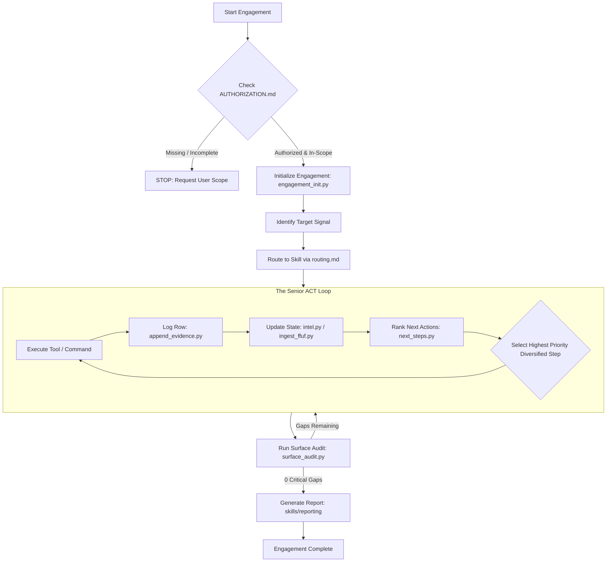

<div align="center">


# Pentest-Skill

### **Autonomous Senior-Grade Methodology Router & Continuous Engagement Framework for AI Coding Agents**

[](https://www.python.org/)
[](LICENSE)
[](pentest-skill/skills)
[-purple.svg?style=for-the-badge)](AGENTS.md)
[](pentest-skill/AUTHORIZATION.example.md)

<br/>

[Key Features](#-key-features) • [System Architecture](#-system-architecture--workflow) • [Quick Start](#-quick-start) • [The 16 Skill Playbooks](#-the-16-skill-playbooks) • [The Senior ACT Loop](#-the-senior-act-loop-methodology) • [CLI Scripts](#-cli-scripts-reference) • [Tool Index](#-supported-tools--environment) • [Verification](#-testing--verification)

</div>

---

## 📖 Executive Summary & Overview

Standard Large Language Model (LLM) coding agents frequently fail at real-world penetration testing and bug bounty engagements. When prompted to test a web target or investigate a system, generalist agents often execute a single superficial `curl` or generic `nmap` scan, encounter a standard HTTP `403 Forbidden` response, and terminate their effort with incomplete conclusions.

**Pentest-Skill** solves this fundamental limitation. It is a zero-global-footprint, repository-local methodology controller that enforces senior offensive security discipline onto AI agents (including Google Antigravity, Claude Code, Cursor, Windsurf, Codex, and terminal LLM runtimes).

### Why Pentest-Skill?

- 🛡️ **Mandatory Scope Gate**: Hard authorization boundaries prevent agents from sending unauthorized packets or scanning out-of-scope targets.
- 🎯 **16 Battle-Tested Playbooks**: Deep, technical instructions and verified command sequences covering Web, API, Mobile, Reverse Engineering, Cloud, Active Directory, and Post-Exploitation.
- 🧠 **Persistent Stateful Memory (`intel.json`)**: Eliminates agent amnesia by tracking hosts, open ports, discovered endpoints, parameter matrices, tech stacks, and confirmed vulnerabilities.
- 🔄 **The Senior ACT Loop**: Automatically chains evidence capture, intelligence ingestion, and heuristic-ranked next steps after every single tool execution.
- 🚦 **Coverage & Surface Auditor (`surface_audit.py`)**: Prevents premature completion by auditing attack surface coverage and highlighting overlooked vulnerability classes.

---

## 🌟 Key Features

```
┌─────────────────────────────────────────────────────────────────────────────┐
│                            PENTEST-SKILL CORE                               │
├──────────────────┬──────────────────┬──────────────────┬────────────────────┤
│  Scope Gatekeeper│ Intelligent Router│ Stateful Intel   │ Coverage Auditor   │
│  Hard boundary   │ 16 domain skills │ Continuous JSON  │ Zero critical gaps │
│  authorization   │ mapped by signal │ memory across    │ verified prior to  │
│  validation      │ & tech indicators│ execution loops  │ final reporting    │
└──────────────────┴──────────────────┴──────────────────┴────────────────────┘
```

1. **Agent-Neutral Architecture**: Zero vendor lock-in. Reads cleanly through `AGENTS.md`, `CLAUDE.md`, `README_AI.md`, or direct prompt bootstrapping (`pentest-skill/SKILL.md`).
2. **Heuristic Next-Step Ranking Engine**: Evaluates gathered target intelligence to recommend mathematically prioritized, diversified technical actions.
3. **Structured Ingestion Pipelines**: Built-in parsers for standard security tooling outputs (`Nmap` `-oN` outputs, `ffuf` JSON fuzzing logs, etc.).
4. **Formal Evidence Logging**: Chronological markdown ledger maintaining command execution records, timestamps, tool results, and notes for audit compliance and reporting.
5. **Ethical & Professional Reporting Engine**: Standardized vulnerability stubs and CVSS v3.1 templates for rapid bug bounty submission and client deliverables.

---

## 🏗 System Architecture & Workflow

Pentest-Skill orchestrates the entire penetration testing lifecycle through a structured pipeline:



---

## 🚀 Quick Start

### 1. Clone or Add to Your Project

Clone Pentest-Skill into your existing target workspace:

```bash
# Clone the repository
git clone https://github.com/YOUR_USER/pentest-skill.git my-engagement
cd my-engagement
```

### 2. Configure Scope & Legal Authorization

Create your target-specific authorization record:

```bash
cp pentest-skill/AUTHORIZATION.example.md pentest-skill/AUTHORIZATION.md
```

Edit `pentest-skill/AUTHORIZATION.md` with:
- **Program Name & Source** (e.g., HackerOne, Bugcrowd, VDP, Authorized Pentest Contract)
- **In-Scope Targets** (Specific domains, IP ranges, endpoints, APK files)
- **Out-of-Scope Assets** (Strictly forbidden targets, third-party services)
- **Testing Constraints** (Rate limits, forbidden DoS attacks, safe testing credentials)

> [!IMPORTANT]
> The `pentest-skill/AUTHORIZATION.md` file is gitignored by default to prevent accidental leakage of confidential customer or bounty scopes into version control.

### 3. Initialize Target Engagement

Generate the engagement folder, stateful database, and evidence ledger:

```bash
python3 pentest-skill/scripts/engagement_init.py \
  --target "app.example.com" \
  --mode bounty \
  --skill web-recon
```

This creates the directory `pentest-skill/engagement/app.example.com/` containing:
- `intel.json` — Target state machine
- `evidence.md` — Chronological evidence log
- `evidence/` — Directory for raw tool outputs (`.nmap`, `.json`, `.txt`)

### 4. Direct Your AI Agent

Prompt your agent with simple, direct instructions:

```text
Follow pentest-skill/SKILL.md. Scope is defined in AUTHORIZATION.md.
Engagement is initialized for app.example.com.
Execute the web-recon methodology, ingest findings into intel.json, and chain next_steps.py.
```

---

## 📚 The 16 Skill Playbooks

Pentest-Skill organizes offensive security methodology into 16 specialized playbooks located in `pentest-skill/skills/`.

| Category | Skill | Core Focus & Methodology | Primary Tools |
| :--- | :--- | :--- | :--- |
| **Reconnaissance** | [`web-recon`](pentest-skill/skills/web-recon) | Subdomain discovery, open port scanning, service versioning, directory fuzzing, tech fingerprinting | `nmap`, `ffuf`, `subfinder`, `httpx`, `whatweb` |
| **API Security** | [`api-testing`](pentest-skill/skills/api-testing) | REST/GraphQL audits, OpenAPI/Swagger ingestion, mass assignment, hidden parameter fuzzing | `curl`, `jq`, `ffuf`, `Burp Suite` |
| **Authorization** | [`idor-bola`](pentest-skill/skills/idor-bola) | Horizontal/vertical privilege escalation, BFLA, parameter swap across GET/PUT/DELETE | `Burp Repeater`, `curl`, custom PoCs |
| **Injection** | [`injection`](pentest-skill/skills/injection) | SQLi (Union, Error, Blind, Time), SSTI, Command Injection, XXE, Deserialization | `sqlmap`, `curl`, `Burp Intruder` |
| **Web Infrastructure** | [`http-advanced`](pentest-skill/skills/http-advanced) | HTTP Request Smuggling (CL.TE / TE.CL), Cache Poisoning, Host header injection, 403 bypasses | `curl`, `Burp Repeater`, custom python |
| **Network Pivoting** | [`ssrf`](pentest-skill/skills/ssrf) | Server-Side Request Forgery, cloud metadata interrogation (AWS/GCP/Azure), internal service probing | `curl`, `interactsh`, `Burp Collaborator` |
| **Authentication** | [`oauth-auth`](pentest-skill/skills/oauth-auth) | OAuth2/OIDC flaw analysis, CSRF on login, JWT secret brute-forcing, algorithm confusion | `jwt_tool`, `Burp Suite`, `curl` |
| **Logic & Workflows** | [`business-logic`](pentest-skill/skills/business-logic) | Multi-step transaction bypasses, coupon stacking, race conditions, price manipulation | `Turbo Intruder`, `curl`, `Burp Suite` |
| **Frontend Reverse** | [`js-reverse`](pentest-skill/skills/js-reverse) | Webpack bundle deobfuscation, sourcemap extraction, API key discovery, hidden endpoint mining | `sourcemapper`, `grep`, `nodejs` |
| **Android Static** | [`apk-reverse`](pentest-skill/skills/apk-reverse) | APK decompilation, AndroidManifest component audit, hardcoded cryptographic secrets | `jadx`, `apktool`, `apkid` |
| **Mobile Runtime** | [`mobile-advanced`](pentest-skill/skills/mobile-advanced) | Dynamic hooking, SSL pinning bypass, root detection evasion, biometric bypass | `frida`, `objection`, `adb` |
| **Binary Exploitation** | [`binary-reverse`](pentest-skill/skills/binary-reverse) | ELF/PE analysis, Ghidra decompilation, buffer overflow triage, ROP gadgets, checksec | `ghidra`, `radare2`, `gdb-pwndbg`, `checksec` |
| **Cloud Security** | [`cloud-security`](pentest-skill/skills/cloud-security) | AWS S3 bucket permissions, Azure Blob audits, GCP IAM role privilege escalation | `awscli`, `scoutsuite`, `trufflehog` |
| **Active Directory** | [`ad-pentest`](pentest-skill/skills/ad-pentest) | Internal domain recon, Kerberoasting, AS-REP roasting, BloodHound attack path graph | `impacket`, `bloodhound-python`, `crackmapexec` |
| **Post-Exploitation** | [`post-exploit`](pentest-skill/skills/post-exploit) | Linux/Windows privilege escalation checks, credential harvesting, persistence, cleanup | `linpeas`, `winpeas`, native CLI |
| **Deliverables** | [`reporting`](pentest-skill/skills/reporting) | Executive summaries, technical reproduction steps, CVSS scoring, remediation guidance | Markdown, JSON templates |

---

## 🔄 The Senior ACT Loop Methodology

The hallmark of a senior penetration tester is methodical progression: **Never run a tool without capturing output, never capture output without updating intelligence, and never pick a next step at random.**

```bash
ENG=pentest-skill/engagement/app.example.com
```

### 1. Execute & Save Raw Evidence
Run the chosen security assessment tool, redirecting or outputting findings into the target's `evidence/` directory:

```bash
nmap -sV -sC -T4 --open -oA $ENG/evidence/nmap_quick app.example.com
```

### 2. Append Evidence Entry
Log the exact command and concise outcome in `evidence.md`:

```bash
python3 pentest-skill/scripts/append_evidence.py $ENG/evidence.md \
  --skill web-recon \
  --command "nmap -sV -sC -T4 --open app.example.com" \
  --result "80/http, 443/https (nginx 1.18.0)" \
  --notes "Standard web ports open. Next: Web tech stack & directory fuzzing."
```

### 3. Ingest Findings & Update State
Update `intel.json` with open ports, endpoints, technologies, or parameters discovered:

```bash
# Ingest Nmap output directly
python3 pentest-skill/scripts/intel.py $ENG/intel.json ingest-nmap $ENG/evidence/nmap_quick.nmap

# Mark the specific recon task as completed
python3 pentest-skill/scripts/intel.py $ENG/intel.json mark-done nmap_quick

# Add newly identified endpoints and parameters
python3 pentest-skill/scripts/intel.py $ENG/intel.json add-endpoint "https://app.example.com/api/v2"
python3 pentest-skill/scripts/intel.py $ENG/intel.json add-param "GET /api/v2/items?search="
python3 pentest-skill/scripts/intel.py $ENG/intel.json add-tech "nginx 1.18.0"
```

### 4. Ingest Fuzzing Discoveries
When fuzzing paths or parameters with `ffuf`, automatically parse the results:

```bash
ffuf -u https://app.example.com/FUZZ -w /usr/share/wordlists/dirb/common.txt \
  -o $ENG/evidence/ffuf_dirs.json -of json

python3 pentest-skill/scripts/ingest_ffuf.py $ENG/intel.json $ENG/evidence/ffuf_dirs.json \
  --base-url https://app.example.com
```

### 5. Calculate Ranked Next Steps
Query the heuristics engine to determine the highest-impact subsequent actions:

```bash
python3 pentest-skill/scripts/next_steps.py $ENG/intel.json -n 5
```

The engine balances technical vectors across skills to prevent infinite loops on a single endpoint.

---

## 🛠 CLI Scripts Reference

| Script | Purpose | Key Arguments / Example |
| :--- | :--- | :--- |
| `engagement_init.py` | Initializes new target engagement directory & JSON state | `--target <host> [--mode bounty\|vdp\|lab\|ctf] [--skill <skill>]` |
| `intel.py` | Query & manipulate target state in `intel.json` | `intel.json <subcommand> [args]` (see subcommands below) |
| `append_evidence.py` | Appends structured row to `evidence.md` | `--skill <skill> --command "<cmd>" --result "<summary>"` |
| `ingest_ffuf.py` | Parses ffuf JSON output into `intel.json` endpoints | `<intel_json> <ffuf_json> [--base-url <url>]` |
| `next_steps.py` | Heuristically scores and displays prioritized next actions | `<intel_json> [-n LIMIT] [--no-diversify] [--json]` |
| `surface_audit.py` | Audits coverage gaps prior to completion gate | `<intel_json> [--json]` |
| `test_chaining.py` | Smoke test suite verifying end-to-end chaining | `python3 pentest-skill/scripts/test_chaining.py` |

### `intel.py` Subcommands

```bash
# Mark action completed or blocked
python3 pentest-skill/scripts/intel.py $ENG/intel.json mark-done <action_id>
python3 pentest-skill/scripts/intel.py $ENG/intel.json mark-blocked <action_id> --reason "<reason>"

# Record findings and notes
python3 pentest-skill/scripts/intel.py $ENG/intel.json add-vuln --severity high "BOLA on GET /api/v2/orders/{id}"
python3 pentest-skill/scripts/intel.py $ENG/intel.json note "WAF blocks 'UNION SELECT' - try inline comments"

# Update attack surface components
python3 pentest-skill/scripts/intel.py $ENG/intel.json add-host "admin.example.com"
python3 pentest-skill/scripts/intel.py $ENG/intel.json add-endpoint "https://app.example.com/auth/callback"
python3 pentest-skill/scripts/intel.py $ENG/intel.json add-param "POST /api/export format="
python3 pentest-skill/scripts/intel.py $ENG/intel.json add-tech "GraphQL (Apollo)"
python3 pentest-skill/scripts/intel.py $ENG/intel.json set-waf "Cloudflare"
python3 pentest-skill/scripts/intel.py $ENG/intel.json set-skill "idor-bola"
```

---

## 🧰 Supported Tools & Environment

Pentest-Skill integrates with standard security tooling available out of the box in **Kali Linux**, **Parrot OS**, or standard Linux/macOS security distributions.

```bash
# Verify environment readiness
for cmd in nmap curl python3 ffuf jadx apktool frida r2; do
  command -v "$cmd" >/dev/null && echo "✅ OK: $cmd" || echo "❌ MISSING: $cmd"
done
```

| Tool | Category | Primary Function | Installation Check |
| :--- | :--- | :--- | :--- |
| **Nmap** | Port Scanner | Port discovery & banner grabbing | `nmap --version` |
| **Burp Suite** | HTTP Proxy | Interception, Repeater, Intruder | Check proxy on `127.0.0.1:8080` |
| **curl / jq** | CLI HTTP & JSON | Scripted API queries & JSON parsing | `curl --version && jq --version` |
| **ffuf** | Web Fuzzer | Directory & parameter brute-forcing | `ffuf -V` |
| **subfinder / amass** | OSINT | Passive subdomain enumeration | `subfinder -version` |
| **jadx / apktool** | Mobile Reverse | APK decompilation & resource decoding | `jadx --version && apktool -version` |
| **Frida** | Dynamic Hooking | Mobile runtime instrumentation & pinning bypass | `frida --version` |
| **Radare2 / Ghidra** | Binary Analysis | Decompilation, disassembly, ELF/PE triage | `r2 -v` |
| **Impacket / CrackMapExec** | AD / Windows | Active Directory protocol inspection | `crackmapexec --version` |

---

## 📁 Repository Layout

```text
.
├── AGENTS.md                          # Universal Agent entry point (Cursor, Antigravity, Windsurf)
├── CLAUDE.md                          # Native instructions for Claude Code
├── README.md                          # Comprehensive project documentation & architecture guide
├── README_AI.md                       # Condensed machine-readable agent checklist
├── CONTRIBUTING.md                    # Guidelines for contributing new skills & scripts
├── LICENSE                            # MIT License
├── assets/
│   └── logo.png                       # Official Pentest-Skill emblem & logo
└── pentest-skill/
    ├── SKILL.md                       # Senior operator controller entry point
    ├── AUTHORIZATION.example.md       # Scope template (must be filled before scanning)
    ├── routing.md                     # Keyword and indicator to skill routing matrix
    ├── tool-index.md                  # Supported tool directory and sanity checkers
    ├── shared/                        # Universal operational doctrine
    │   ├── senior-operator.md         # Mindset, validation rules, quality gates
    │   ├── attack-surface.md          # Surface mapping & parameter taxonomy
    │   └── chaining.md                # Tool chaining & ACT loop execution rules
    ├── scripts/                       # Automation, state management, and ranking engine
    │   ├── engagement_init.py         # Engagement folder & intel generator
    │   ├── intel.py                   # State machine interface (CLI)
    │   ├── next_steps.py              # Heuristic prioritized next-step engine
    │   ├── surface_audit.py           # Pre-completion coverage audit validator
    │   ├── ingest_ffuf.py             # Ffuf JSON parser
    │   ├── append_evidence.py         # Structured evidence ledger appender
    │   └── test_chaining.py           # Unit & smoke test suite
    ├── skills/                        # 16 Specialized skill playbooks
    │   ├── web-recon/                 # Port scan, directory fuzzing, subdomain discovery
    │   ├── idor-bola/                 # Broken Object Level Authorization & IDOR testing
    │   ├── api-testing/               # REST/GraphQL endpoints & mass assignment
    │   ├── injection/                 # SQLi, SSTI, Command Injection, XXE
    │   ├── http-advanced/             # Request smuggling, cache poisoning, 403 bypass
    │   ├── ssrf/                      # Internal probing & cloud metadata extraction
    │   ├── oauth-auth/                # OAuth2/OIDC flows, JWT tampering
    │   ├── business-logic/            # Transaction bypasses, race conditions
    │   ├── js-reverse/                # JavaScript bundle mining & sourcemap analysis
    │   ├── apk-reverse/               # Android static reverse engineering
    │   ├── mobile-advanced/           # Frida instrumentation & SSL pinning bypass
    │   ├── binary-reverse/            # ELF/PE disasm, Ghidra analysis, ROP
    │   ├── cloud-security/            # S3/Azure/GCP misconfigurations & IAM
    │   ├── ad-pentest/                # Active Directory & Kerberos exploitation
    │   ├── post-exploit/              # Privilege escalation & persistence checks
    │   └── reporting/                 # Executive summaries & CVSS v3.1 reports
    ├── engagement/                    # Target data directory (gitignored)
    └── field-journal/                 # Reusable engagement notes & templates
```

---

## 🧪 Testing & Verification

Run the built-in smoke test suite to verify engagement bootstrapping, JSON state parsing, and recommendation chaining:

```bash
python3 pentest-skill/scripts/test_chaining.py
```

Expected output:
```text
OK chaining smoke test passed
```

You can also run bytecode compilation across all internal tools:

```bash
python3 -m py_compile pentest-skill/scripts/*.py
```

---

## ⚖️ Legal, Ethics & Responsible Disclosure

> [!CAUTION]
> **Strictly for Authorized Testing Only**
> 
> Pentest-Skill is engineered exclusively for authorized bug bounty programs, formal penetration testing engagements under contract, Vulnerability Disclosure Programs (VDPs), Capture The Flag (CTF) challenges, and self-hosted security research labs.
> 
> Unauthorized scanning, probing, or exploitation of computer systems without explicit written permission is illegal and strictly prohibited.

1. **Verify Authorization**: Never execute commands against targets not explicitly documented in `pentest-skill/AUTHORIZATION.md`.
2. **Respect Program Rules**: Abide by rate limits, excluded targets, and safe-harbor clauses.
3. **No Disruptive Testing**: Avoid denial-of-service attacks, destructive payloads, or data destruction.
4. **Responsible Disclosure**: Report vulnerabilities promptly and securely to the target organization following coordinated vulnerability disclosure policies.

---

## 🤝 Contributing

Contributions of new playbooks, tool ingestion parsers, and methodology improvements are welcome! Please review [CONTRIBUTING.md](CONTRIBUTING.md) before submitting pull requests.

---

## 📄 License

This project is licensed under the [MIT License](LICENSE).
